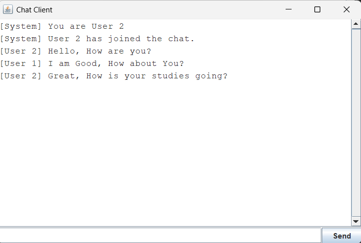
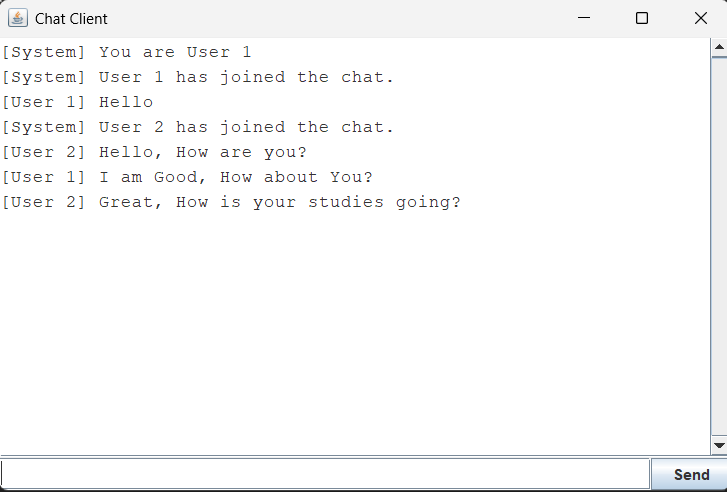
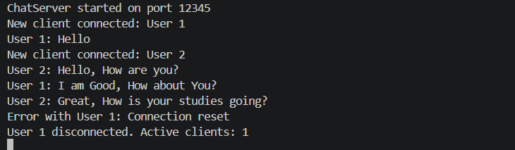

# Online Chat Application - Java Socket Programming

**A multithreaded client‑server chat system with a graphical user interface (Swing), enabling real‑time messaging among multiple connected users.**

---

## 📖 Overview

This project is a simple yet robust **online chat application** built entirely in Java. It demonstrates core networking concepts such as **TCP socket programming**, **multithreading**, and **client‑server architecture**.

- The **server** (`ChatServer`) listens for incoming connections, assigns a unique identifier (ID) to each client, and broadcasts every received message to all currently connected users.
- The **client** (`ChatClient`) provides a clean Swing‑based graphical interface where users can type messages, send them to the server, and view incoming messages from other users in real time.

---

## ✨ Features

| Feature | Description |
| :--- | :--- |
| **Multi‑client Support** | The server can handle an unlimited number of concurrent clients using separate handler threads. |
| **Unique User IDs** | Each connected client automatically receives a sequential numeric ID (e.g., User 1, User 2). |
| **Message Broadcasting** | Any message sent by one client is relayed to **all** connected clients, creating a group‑chat experience. |
| **Join / Leave Notifications** | System messages inform all users when someone joins or leaves the chat. |
| **Graphical User Interface (Swing)** | Features a scrollable chat history, an input text field, and a "Send" button, with support for the **Enter key**. |
| **Auto‑Scrolling** | The chat window automatically scrolls down to display the latest messages. |
| **Graceful Disconnection** | If the server goes down or the connection is lost, the client displays an error dialog and exits cleanly. |

---

## 🛠️ Technologies Used

- **Java SE** (JDK 8 or higher)
- **Java Networking (`java.net`)** – Sockets, ServerSocket
- **Java I/O (`java.io`)** – BufferedReader, PrintWriter
- **Java Swing (`javax.swing`)** – GUI components (JFrame, JTextArea, etc.)
- **Multithreading (`java.lang.Thread`)** – For handling concurrent clients and message reading

---

## ⚙️ Prerequisites

Before running the application, ensure you have the following installed on your system:

- [Java Development Kit (JDK)](https://www.oracle.com/java/technologies/downloads/) – version 8 or newer.
- A terminal / command prompt (or an IDE such as IntelliJ IDEA, Eclipse, or VS Code).

---

## 📥 Setup & Installation

### 1. Clone or Download the Source Code

Save the following two files in the **same directory**:
- `ChatServer.java`
- `ChatClient.java`

### 2. Compile the Code

Open a terminal in the project directory and run:

```bash
javac ChatServer.java 
Java ChatClient.java
```

> ✅ Successful compilation will generate `ChatServer.class` and `ChatClient.class`.

---

## 🚀 How to Use the Application

> **Important:** The server must be started **before** any clients.

### Step 1: Start the Server
Open a terminal and execute:
```bash
java ChatServer
```
**Expected output:**
```
ChatServer started on port 12345
```
The server is now running and waiting for client connections.

### Step 2: Start the First Client
Open a **new** terminal (or a new tab) and run:
```bash
java ChatClient
```
- A GUI window titled **"Chat Client"** will appear.
- The client connects to the server and receives the ID **User 1**.
- The chat area will show: `[System] You are User 1`

### Step 3: Start Additional Clients
To add more users, simply open additional terminals and run `java ChatClient` again.

- The second client becomes **User 2**, the third **User 3**, and so on.
- When a new client joins, all existing clients will see a notification, e.g.:
  ```
  [System] User 2 has joined the chat.
  ```

### Step 4: Start Chatting!
- Type a message in the text field at the bottom of the client window.
- Press **Enter** or click the **Send** button.
- The message will appear in **every** connected client's chat window with the sender's ID prefix, e.g.:
  ```
  [User 1] Hello everyone!
  ```

### Step 5: Leaving the Chat
- Simply close the client window. The server automatically detects the disconnection and broadcasts a leave notification to remaining users.

---

## 📂 Project Structure

```
📁 OnlineChatApplication/
│
├── ChatServer.java          # Server-side logic
│   ├── main()               # Starts ServerSocket & accepts clients
│   ├── broadcast()          # Sends messages to all clients
│   ├── removeClient()       # Cleans up disconnected clients
│   └── ClientHandler (inner class)
│       ├── run()            # Reads from a client & broadcasts messages
│       └── sendMessage()    # Writes to a specific client
│
├── ChatClient.java          # Client-side logic & GUI
│   ├── main()               # Launches the Swing GUI
│   ├── start()              # Connects to server & initialises streams
│   ├── buildGUI()           # Creates the Swing interface
│   ├── sendMessage()        # Sends user input to the server
│   └── readMessages()       # Background thread: receives server broadcasts
│
└── README.md                # This file
```

---

## 🔌 Communication Protocol

The application uses a simple **plain‑text protocol** over TCP:

- **Message Format:** Lines of text terminated by a newline character (`\n`).
- **Sending:** The client writes the raw message to the server via `PrintWriter`.
- **Receiving:** The server reads lines using `BufferedReader`.
- **Broadcasting:** The server prefixes the sender's ID to the message (e.g., `[User 3] My message`) and sends it to every active client.
- **System Messages:** Begin with `[System]` to distinguish them from user messages.

---

## 🛑 Troubleshooting

| Issue | Likely Cause & Solution |
| :--- | :--- |
| **`java.net.BindException: Address already in use`** | Another instance of the server is already running. Close the existing server process and restart. |
| **`java.net.ConnectException: Connection refused`** | The server is not running. Ensure you start `ChatServer` before launching any clients. |
| **Clients cannot see each other on different machines** | Change the `SERVER_HOST` in `ChatClient.java` from `"localhost"` to the **server machine's actual IP address** (e.g., `192.168.1.x`). Ensure both machines are on the same network and firewall rules allow port `12345`. |
| **GUI does not respond or freezes** | Ensure all networking tasks are handled in background threads (they are in this implementation). If modified, never block the Event Dispatch Thread (EDT). |
| **Port 12345 is blocked** | You can modify the `PORT` constant in `ChatServer.java` and the corresponding `SERVER_PORT` in `ChatClient.java` to any available port (e.g., `8080`). |

---

## 🖼️ Screenshots

### Example of the Client GUI
- **Chat Display**: Shows system messages and user messages with clear formatting.
- **Input Area**: Bottom panel containing the text field and Send button.

**View (Client 1):** <br>


**View (Client 2):** <br>


### Server Console <br>


---

## 👤 Author

**Student Developer / Assignment Submission**  
*Java Networking & GUI Development*  
- Implemented as per the course requirements for the Online Chat Application assignment.

---

## 📄 License

This project is created for educational purposes and is free to use and modify for learning Java networking and Swing.

---

**Thank you for reviewing this submission!**  
For any questions or issues, please refer to the troubleshooting section above or contact the course instructor.